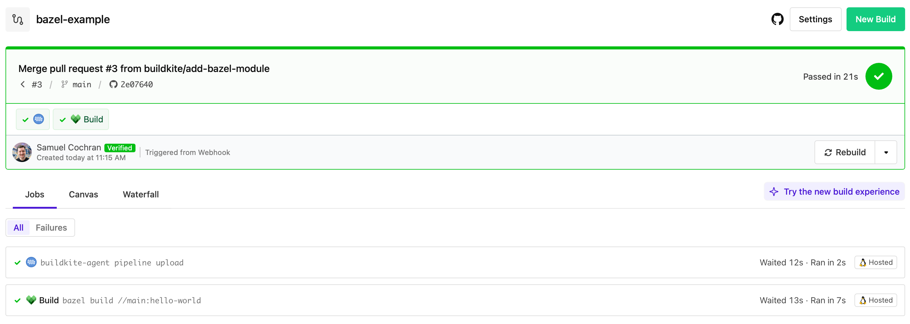

# Buildkite Bazel Pipeline Example

[](https://buildkite.com/buildkite/bazel-example/builds/latest?branch=main)
[](https://buildkite.com/new)

This repository is an example [Buildkite](https://buildkite.com/) pipeline that uses [Bazel](https://bazel.build) to build a C++ project.

👉 **See this example in action:** [buildkite.com/buildkite/bazel-example](https://buildkite.com/buildkite/bazel-example/builds/latest?branch=main)

[](https://buildkite.com/new)

<a href="https://buildkite.com/buildkite/bazel-example/builds/latest?branch=main">
  
</a>

<!-- docs:start -->
## How it works

The empty `WORKSPACE` file marks the directory as a Bazel workspace, and `main/BUILD` defines the build targets.

The [pipeline.yml](.buildkite/pipeline.yml) tells Bazel to build the `hello-world` target in `main/BUILD`:

```yml
steps:
  - label: ":bazel: Build"
    commands:
      - bazel build //main:hello-world
```

The `hello-world` target uses the Bazel`cc_binary` rule to build a `hello-world` executable from the source file `hello-world.cc`.

If you want to test the result by running the resulting binary, add the following line to your copy of the Pipeline:

```yml
        - bazel-bin/main/hello-world
```

## Setup

You'll need some dependencies installed alongside your [Buildkite Agent](https://buildkite.com/docs/agent/v3):

- [Bazel](https://bazel.build) - we recommend using [Bazelisk](https://github.com/bazelbuild/bazelisk)
- C++ compiler, like GCC

An example Dockerfile for an image with the agent and these dependencies:

```Dockerfile
FROM buildkite/agent:3

# Install gcc etc
RUN apt-get update && apt-get install -y build-essential

ARG TARGETOS
ARG TARGETARCH

# Install bazelisk
ADD --chmod=0755 https://github.com/bazelbuild/bazelisk/releases/download/v1.26.0/bazelisk-${TARGETOS}-${TARGETARCH} /usr/local/bin/bazel

# or a specific version of Bazel, if you want to lock it down
#ADD --chmod=0755 https://releases.bazel.build/8.2.1/release/bazel-8.2.1-${TARGETOS}-${TARGETARCH} /usr/local/bin/bazel
```

On macOS, you can use [Homebrew](https://brew.sh) to [install the Buildkite Agent](https://buildkite.com/docs/agent/v3/macos) and Bazelisk:

```
brew install bazelisk
```

Homebrew should prompt you to install Xcode Command Line Tools which includes a C++ compiler. If not:

```
xcode-select --install
```
<!-- docs:end -->

## License

See [LICENSE](LICENSE) (MIT)
